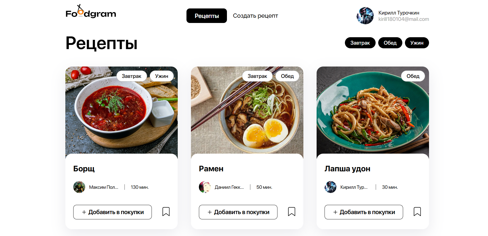

# Foodgram - веб-сервис для обмена рецептами

## Стек технологий


<https://foodwarf.hopto.org/>

Веб-приложение, где пользователи могут делиться рецептами, подписываться на авторов, сохранять рецепты в избранное и формировать список покупок. Проект реализован с чистой архитектурой и развёрнут в Docker-контейнерах.



## Основные функции

- Регистрация и аутентификация пользователей
- Публикация рецептов с возможностью добавления изображений
- Добавления аватара в профиль
- Добавление рецептов в избранное
- Подписка на других пользователей
- Формирование списка покупок
- Поиск рецептов по тегам и ингредиентам
- Генерация корротких ссылок на рецепт

## Установка

### Клонирование репозитория

```bash
git clone https://github.com/WarfoIomey/kittygram_final.git
cd foodgram
```

## Структура проекта

- `backend/` — содержит исходный код серверной части приложения.
- `foodgram/` — основное приложение Django.
- `recipes/` — приложение для работы с рецептами.
- `users/` — приложение для управления пользователями.
- `api/` — реализация API на основе Django REST Framework.
- `frontend/` — Фронт приложения.
- `api/docs/` — документация по проекту.

## API документация

Основные эндпоинты:

- `GET /api/recipes/` — получение списка рецептов.
- `POST /api/recipes/` — создание нового рецепта.
- `GET /api/ingredients/` — поиск ингредиентов по названию.
- `POST /api/users/` — регистрация нового пользователя.

Более подробные требования к полям моделей можно найти в `/api/docs/`.
Находясь в папке infra, выполните в терминале команду:
```docker compose up```

<http://localhost/api/docs/> — Документация к API.


## Развёртывание на сервер

Выполните следующие команды:
```
docker compose up --build
docker compose exec backend python manage.py migrate
docker compose exec backend python manage.py collectstatic
docker compose exec backend cp -r /app/collected_static/. /backend_static/static/
```
После успешного выполнения этих команд приложение будет доступно по адресу <http://localhost:8000>.

## Настройки окружения

Перед запуском приложения настройте переменные окружения (пример в файле .env_example):

- `POSTGRES_USER`— пользователь базы данных.
- `POSTGRES_PASSWORD`— пароль пользователя базы данных.
- `POSTGRES_DB`— имя базы данных PostgreSQL.
- `SECRET_KEY` — секретный ключ Django.
- `DB_HOST` — хост базы данных.
- `DB_PORT` — порт для подключения к базе данных.
- `ALLOWED_HOSTS` — список доступных хостов.
- `DEBUG` — статус отладки Django.
